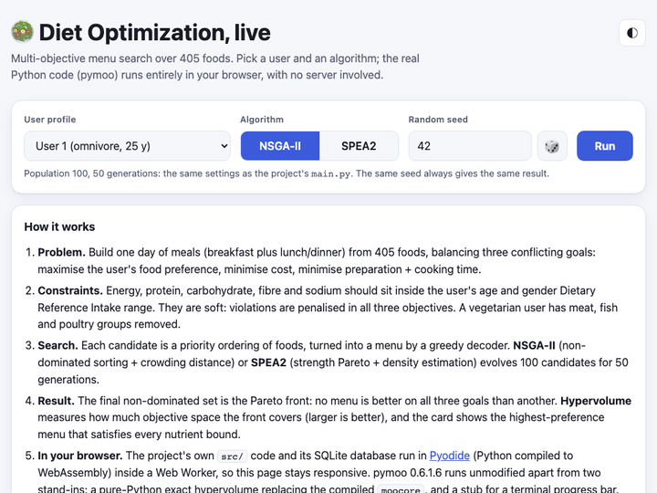
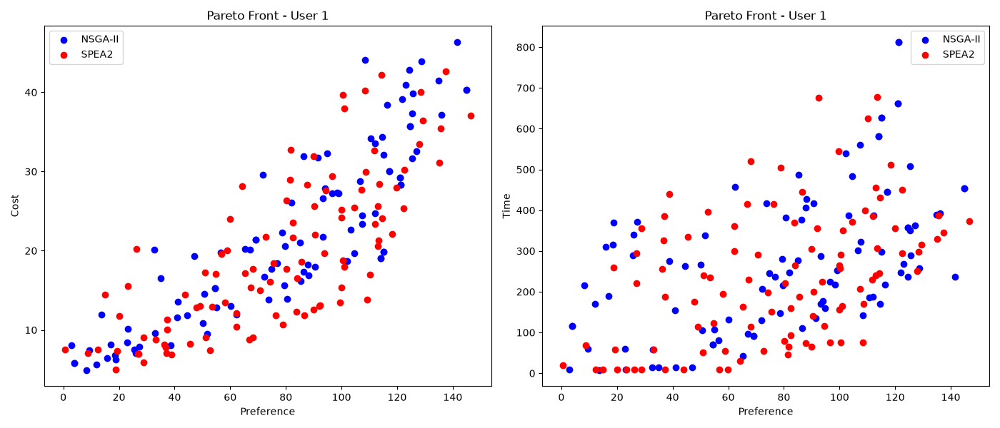
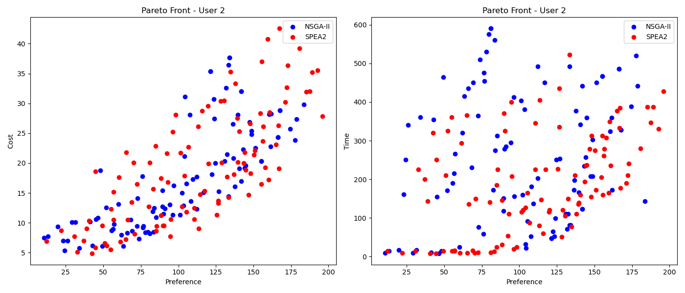
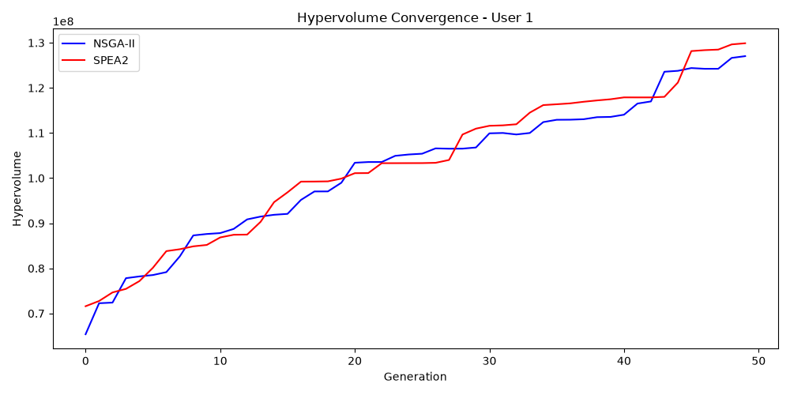
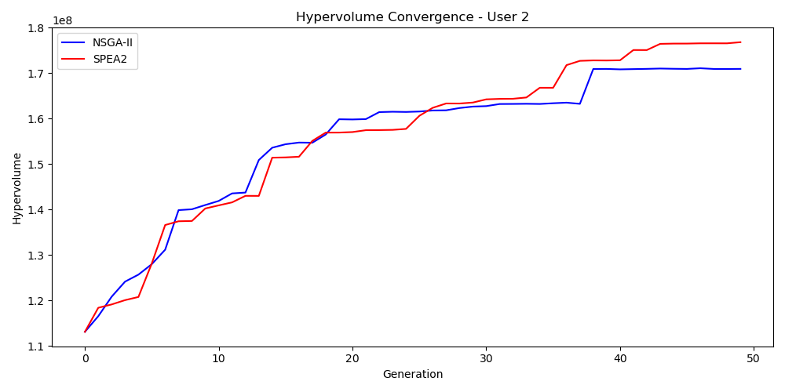

# 🥗 Multi-Objective Diet Optimization (MODP)

Recommends daily menus from 405 food items and returns a Pareto front of preference / cost / preparation-time trade-offs, using NSGA-II (pymoo).


<p align="center">
  <a href="https://saadosama10.github.io/diet-optimization/demo/"></a>
</p>

<p align="center">
  <a href="https://saadosama10.github.io/diet-optimization/demo/"></a>
</p>

👥 Team: Saed O S Radi, Kenan Alemam, Ahmed Alsaleh, Abdulrahman Aljabahji, Mamdouh Al Masri — Heuristic Optimization course project (FSMVU)

## Live demo

[**Open the demo →**](https://saadosama10.github.io/diet-optimization/demo/) Pick a user profile, NSGA-II or SPEA2 and a seed, press **Run**, and explore the Pareto front (3D or 2D), the hypervolume, the number of fully DRI-compliant menus and the best compliant menu. There is no server: the repository's own Python code (`src/`, the SQLite backend, pymoo 0.6.1.6) runs in your browser through [Pyodide](https://pyodide.org) in a Web Worker. A run (population 100, 50 generations, same as `main.py`) takes about 3 s on a laptop after a one-time ~25 MB download of the Python runtime.

**What is and is not identical to the desktop code.** `src/` and `data/` are used unchanged. Two things differ, neither affects results: (1) pymoo's compiled helpers (`moocore` for hypervolume, a terminal progress bar) cannot run in WebAssembly, so `docs/demo/shims/` provides a pure-Python exact hypervolume and a stub; (2) the original code never passes a seed to pymoo, so `docs/demo/runner.py` injects one (by wrapping `minimize`) to make runs repeatable.

**Parity check.** [`scripts/demo_parity.py`](scripts/demo_parity.py) compares the browser with the original code under CPython (pymoo 0.6.1.6, compiled helpers) for 2 users × 2 algorithms × 2 seeds. On the live site all 8 cases are identical: every one of the 100 × 3 Pareto objective values (max difference 0.0), every decoded menu, the DRI-compliant count and the best menu; hypervolume agrees to ≤ 5.3e-16 relative (floating-point rounding).

```
case                       result   max |dF|  HV rel diff               HV compliant
user1_nsga2_seed42         PASS      0.0e+00      1.2e-16      120204235.5    12
user1_nsga2_seed2024       PASS      0.0e+00      4.2e-16      107598014.9    10
user1_spea2_seed42         PASS      0.0e+00      0.0e+00      120322729.5    16
user1_spea2_seed2024       PASS      0.0e+00      5.0e-16      120300213.6    10
user2_nsga2_seed42         PASS      0.0e+00      5.2e-16      170956582.6     3
user2_nsga2_seed2024       PASS      0.0e+00      5.3e-16      168910941.5     2
user2_spea2_seed42         PASS      0.0e+00      1.7e-16      176831638.2     7
user2_spea2_seed2024       PASS      0.0e+00      0.0e+00      199446166.3     3
```

To rebuild the bundle after changing `src/` or `data/`: `python scripts/build_demo_bundle.py`. To re-run the parity check: `python scripts/demo_parity.py reference`, then `node scripts/demo_parity_browser.mjs <demo url> browser.json` (needs `playwright`) and `python scripts/demo_parity.py compare browser.json`.

## Overview

Choosing a day of meals means balancing what a person likes, what it costs and how long it takes to prepare, while still meeting daily nutrient targets. These goals conflict, so there is no single best menu. This project searches for **non-dominated menus** (a Pareto front) for a given user, taking the user's own food ratings, their age/gender-specific Dietary Reference Intake (DRI) bounds, and a vegetarian filter into account.

Besides NSGA-II, the repository implements **SPEA2** for comparison, tracks **hypervolume** per generation, and includes an experiment on a **diversity penalty** (food-group variety).

## Problem formulation (as implemented)

The problem is a knapsack-style selection with several nutrient constraints and three objectives. It is **not** coded as a binary 0/1 knapsack vector: the optimizer evolves a priority ordering over foods and a greedy decoder turns it into a menu.

**Decision variables.** One gene per candidate food: breakfast pool + lunch/dinner pool (user 1: 91 + 314 = 405 genes; user 2, vegetarian: 91 + 212 = 303). pymoo evolves them as a float vector with its default operators (random sampling, SBX crossover, polynomial mutation). Each gene is cast to an integer and mapped `mod pool size` to a food id, giving a priority list for each meal. The genes are not constrained to be a permutation, so a food can appear more than once in a menu.

**Greedy decoder** (`src/chromosome.py`). Foods are scanned in priority order and skipped if their global `preference` is −1:
- *Breakfast:* add foods until energy and protein both reach 35 % of their daily lower bound; skip a food that would push energy or protein above 35 % of its daily upper bound.
- *Lunch/dinner:* continue with the running nutrient totals; skip a food if any of the five nutrients would exceed its upper bound × 1.15; stop once all five reach their lower bound × 0.90.

**Objectives** (what pymoo minimizes), with `R` the penalty below:

| | Objective | Direction |
|---|---|---|
| f1 | −(total preference) + R | maximize preference |
| f2 | total cost + R | minimize cost |
| f3 | total preparation + cooking time + R | minimize time |

A food's preference is the user's own rating (`user_foods`) when present, otherwise the food's default rating.

**Constraints (soft, via penalty).** Energy, protein, carbohydrate, fibre and sodium should lie in the user's `[RLL, RUL]` DRI range. For each nutrient, `R += 0.7·max(0, RLL−v)/(RUL−RLL) + 0.3·max(0, v−RUL)/(RUL−RLL)`, plus a diversity term `alpha / (number of distinct food groups)` with `alpha = 1.0` (`alpha = 0` disables it). Penalty weight λ = 1. Because the constraints are soft, a decoded menu can still fall outside the bounds (see [Known Limitations](#known-limitations)).

**Vegetarian filter.** A user is treated as vegetarian if more than 50 % of their ratings for meat/fish/poultry food groups are −1; those groups are then removed from the candidate pools.

## Why NSGA-II

The three objectives are in conflict and there is no sensible way to fix their weights in advance. NSGA-II ranks solutions by non-domination and keeps the front spread out with crowding distance, so a single run returns many alternative menus to choose from rather than one weighted-sum compromise. It is available as a tested implementation in pymoo, and SPEA2 from the same library gives a point of comparison on the identical problem.

## Pipeline

```
data/*.csv ──► SQLite (or MySQL) ──► DietProblem ──► NSGA-II / SPEA2 ──► Pareto front ──► decoded menus
 foods, nutrients,    src/database.py   decoder + objectives   pymoo, 100 pop × 50 gen   plots, CSVs      sample menus + DRI table
 DRI, user ratings                      + penalty
```

## Results

Single run of `python main.py` (population 100, 50 generations, ~10 s on a laptop). The raw outputs are in [`results/`](results/). Objective values in the plots and CSVs include the penalty term `R`; the menu tables show the raw preference, cost and time of the decoded menu.

| User | Algorithm | Pareto solutions | Final hypervolume* | Solutions inside all strict DRI bounds |
|---|---|---|---|---|
| 1 (non-vegetarian) | NSGA-II | 100 | 127,026,596 | 6 / 100 |
| 1 (non-vegetarian) | SPEA2 | 100 | 129,883,896 | 10 / 100 |
| 2 (vegetarian) | NSGA-II | 100 | 183,210,195 | 7 / 100 |
| 2 (vegetarian) | SPEA2 | 100 | 175,587,230 | 7 / 100 |

\* Reference point `[0, 1000, 1000]` on (−preference, cost, time). Both sample users in the dataset are 25-year-old women (DRI bounds: 2000–2400 kcal, 40–100 g protein, 170–300 g carbohydrate, ≥ 20 g fibre, 1500–2300 mg sodium).

The runs are not seeded, so numbers vary from run to run. Across repeated runs of this code, the order of NSGA-II and SPEA2 by hypervolume changed, so these results do not show that one algorithm is better.

**Pareto fronts** (preference vs cost, preference vs time):

| User 1 | User 2 |
|---|---|
|  |  |

**Hypervolume convergence:**

| User 1 | User 2 |
|---|---|
|  |  |

**Diversity penalty (NSGA-II, user 1, `alpha` 1.0 vs 0.0):** both settings fill the 100-slot population with non-dominated solutions, so front size does not separate them in this run. See [`results/diversity_user1.png`](results/diversity_user1.png).

**Example recommended menu** — the highest-preference NSGA-II solution for user 1 that satisfies every DRI bound (food names are the original Turkish dataset names):

```
Preference: 93.30 | Cost: 26.45 | Time: 170 min | Food groups: 8

Breakfast:  FINDIK EZMESİ, ERİK, KURU KAYISI, PORTAKAL SUYU, KARPUZ, KARPUZ,
            INCİR REÇELİ, ÜZÜM PEKMEZİ, GREYFURT SUYU
Lunch/Dinner: HAVUÇ-TURP SALATASI LD, HAYDARİ, TEL ŞEHRİYE ÇORBASI,
              SEMİZOTU SALATASI LD, HASANPAŞA KÖFTE

Nutrient          Total      RLL      RUL
Energy           2293.7   2000.0   2400.0   ok
Protein            78.1     40.0    100.0   ok
Carbohydrate      276.0    170.0    300.0   ok
Fiber              22.8     20.0   9999.0   ok
Sodium           1642.4   1500.0   2300.0   ok
```

More menus: [`results/example_menu_user1.txt`](results/example_menu_user1.txt), [`results/example_menu_user2.txt`](results/example_menu_user2.txt), [`results/sample_menus_user1.txt`](results/sample_menus_user1.txt), [`results/sample_menus_user2.txt`](results/sample_menus_user2.txt).

## Dataset

405 prepared foods (29 food groups) with cost, preference rating, preparation/cooking time and CO₂ values, nutrient contents for five nutrients (energy, protein, carbohydrate, fibre, sodium), per-age/gender DRI bounds, and per-user food ratings for 125 users. The data is the Turkish food database provided for the Heuristic Optimization course (FSMVU); food data and images from diyetasistan.com.

`data/*.csv` is a **sanitized export** of only the columns the code reads. User names, usernames and password hashes are not included; users are identified by an anonymous numeric id with age and gender. `data/schema.sql` is the matching schema.

## Project structure

```
├── main.py                 # runs all experiments, writes results/
├── src/
│   ├── database.py         # SQLite / MySQL access (backend chosen by env vars)
│   ├── chromosome.py       # greedy decoder (genes → menu)
│   ├── objectives.py       # objective evaluation
│   ├── penalty.py          # nutrient + diversity penalties
│   ├── menu_table.py       # decoded sample menus and DRI table
│   └── algorithms/         # nsga2.py, spea2.py
├── data/                   # sanitized CSVs + schema.sql (diet.sqlite is built on first run)
├── scripts/                # build_sqlite.py, import_to_mysql.py, export_from_mysql.py
├── results/                # plots, CSVs, menus, summary from the last run
├── docs/MODP_Report.pdf    # original course report (student numbers redacted)
├── docs/demo/              # live demo (GitHub Pages): index.html, worker.js, runner.py, pybundle.zip, parity/
├── .env.example            # database settings template
├── requirements.txt
└── requirements-mysql.txt
```

## How to run

Tested with Python 3.12.

```bash
git clone https://github.com/SaadOsama10/diet-optimization.git
cd diet-optimization
python -m venv .venv && source .venv/bin/activate
pip install -r requirements.txt
python main.py
```

On the first run the SQLite database `data/diet.sqlite` is built from the CSV files automatically; no database server is needed. `main.py` runs user 1 and user 2 (NSGA-II vs SPEA2, hypervolume) and the diversity experiment for user 1, then writes everything to `results/`.

**Using MySQL instead (optional):**

```bash
pip install -r requirements-mysql.txt
cp .env.example .env          # set DB_BACKEND=mysql, DB_USER, DB_PASSWORD, ...
python scripts/import_to_mysql.py
python main.py
```

Database settings are read from environment variables or a `.env` file; no credentials are stored in the code.

## Improvements over the original version

- **Bug fix: cost and time were being maximized.** `evaluate()` returns all objectives in maximize form, but only preference was negated before pymoo (which minimizes) saw them, so cost and time were maximized and their penalty was rewarded. All three are now minimized correctly (`fix: cost and time were being maximized` commit). The numbers in the original course report (`docs/MODP_Report.pdf`) come from the earlier, buggy version and are not comparable; all results in this README are from the corrected code.
- Database credentials moved out of the code into environment variables; SQLite backend added so the project runs without MySQL.
- Sanitized dataset published; reproducible setup with requirements files and a tested fresh-clone run.
- Headless-safe plotting, automatic `results/` creation, and saved summaries/menus.
- Student numbers redacted from the report PDF.

## Known Limitations

- **Soft constraints.** In this run only 6–10 of the 100 Pareto solutions fall inside every strict DRI bound; the rest violate at least one bound the bounds (the decoder tolerates ×0.90 / ×1.15 on the daily bounds).
- **Not a true permutation encoding.** Genes are real-coded, cast to integers and wrapped with `mod`, so duplicates can occur (a food can appear twice in one menu).
- **Runs are not seeded** in `main.py`, so results differ between runs and the algorithm comparison is inconclusive. (The live demo adds an optional seed so a run can be repeated.)
- **Only two example users** (both 25-year-old women) are evaluated; the dataset contains 125.
- **Penalised objective values.** Plotted/exported objective values include the penalty term; the menu tables show the raw values.
- **Food names are Turkish** and are not translated in the code output.
- The preference −1 exclusion in the decoder uses the food's default `preference`, not the user's own rating.
- The unredacted course report remains in git history of earlier commits.
